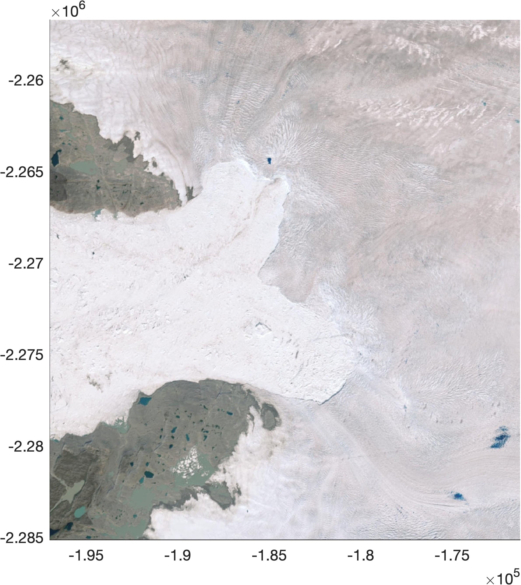

# plot_basemap
A simple function to plot a basemap image in MATLAB. Requires MATLAB's Mapping Toolbox. 

This function uses the Mapping Toolbox function [`readBasemapImage`](https://www.mathworks.com/help/map/ref/readbasemapimage.html) to download a satellite or street map image, then reprojects the image a specified projection, using the extents of any current map that might be open. 

# Syntax

```matlab
plot_basemap(authority,code)
plot_basemap(authority,code,'basemap',basemap) 
[h,Im,x,y,attrib] = plot_basemap(...) 
```

# Description 
`plot_basemap(authority,code)` fills the current extents of a map with a satellite image basemap. The current map must already be open and in the projection defined by authority,code. The authority can be `'EPSG'` or `'ESRI'` and the code is numeric. 

`plot_basemap(authority,code,basemap)` specifies the type of basemap called by `readBasemapImage`. Default is `"satellite"`, and can be changed to `"streets"`, `"streets-light"`, or `"streets-dark"`.

`[h,Im,x,y,attrib] = plot_basemap(...)` returns the handle `h` of the plotted image, and image data `Im`, its coordinates, and `attrib` given by `readBasemapImage`. 

# But why? 
I frequently work in projections that are not directly supported by MATLAB's `readBasemapImage` function. To work in polar stereographic, for example, we need to transform the native output of `readBasemapImage` into EPSG:3413, and this function does all the work. 

# Example 
In the example below, we open a new figure, set the axis limits in north polar stereographic meters, then plot a basemap. 

```matlab
% Open a figure:
figure
 
% Set map axis limits around Jakobshavn Glacier:
axis([-196980    -171290   -2285131   -2256724])
 
% Download and plot a basemap:
plot_basemap('EPSG',3413)
```


# Author Info
Chad Greene of NASA/Jet Propulsion Laboratory, July 2024. 
